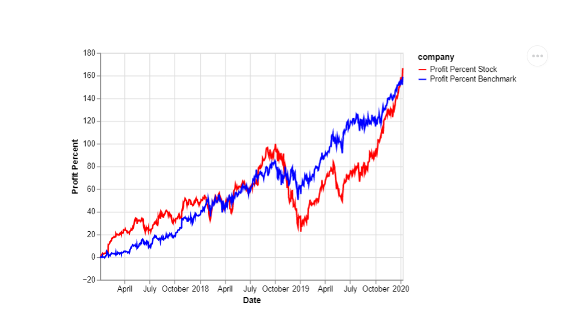
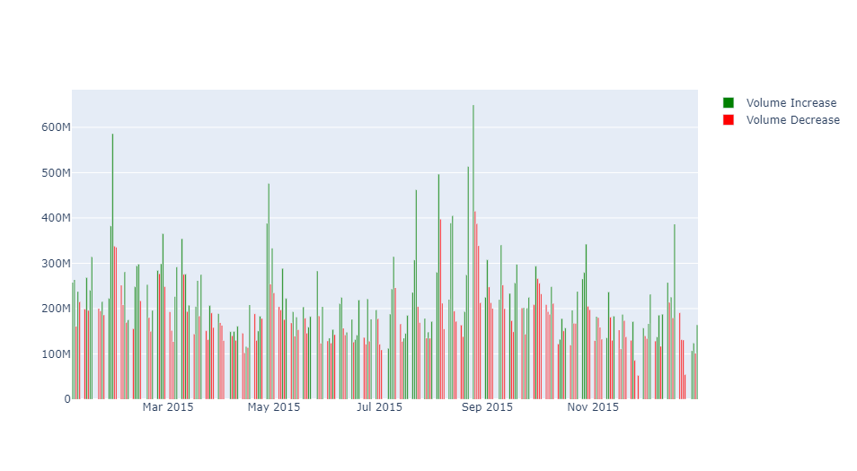

# pystockwatch
 [](https://codecov.io/gh/UBC-MDS/pystockwatch) 

[](https://convertemppy.readthedocs.io/en/latest/?badge=latest)
This toy package is created as part of a group project for DSCI524 of UBC-MDS program. Main idea of the package is to provide a very simple interface for checking movements in stock prices in comparison to the market. This is implemented by accessing public data from Yahoo Finance by selecting a ticker of the stock, range of start and end dates and benchmark for comparison, such as SP500 or NASDAQ. As a result of data processing with pystockwatch package, user will be able to generate two plots: one with two lines showing percentage change since the start date and volumes of trading and another related to daily volume of stock trades as shown at examples below
 
 
 
 
 #### Functions description
 
 This package is built with following four functions:
 - `percent_change`
 Calculation of profit percentage change of a stock for a given period of time based on data extracted from Yahoo finance.
 - `profit_viz`
 Visualization of profit percentage change trend of a stock against market benchmark for a given period of time. Note that during weekends and public holidays, stock market has no data available, this is handled in plotting as well  
 - `volume_change`
 Calculation of daily trading volume change of a stock, whether it is increasing or decreasing. This data is used in  next function for color mapping of bar plot.
 - `volume_viz`
 Visualization of trading volume as bar plots colored by changes in volume in comparison with previous day. This plot is overlayed with line plots created with the second function. . Note that during weekends and public holidays, stock market has no data available, this is handled in plotting as well  
  
 More information about those functions can be found in docstrings of `/src/pystockwatch/pystockwatch.py`
 
#### Comparison with similar packages
There are many packages written for analysis of stock data. One of the most popular Python package in this category is `pyti`, which gives a lot of manipulations with time series data, such as creating moving averages of stock price or calculating hundreds of parameters for technical analysis. Power of `pystockwatch` is in its simplicity, so users are not overwhelmed with all extra features and just have a simple view with key comparisons for a stock of interest

## Installation

```bash
$ pip install pystockwatch
```

## Usage
Usage clarification will be updated after completion of all functions. In general, after installation of this package user will be required to input four parameters: `stock_ticker`, `start_date`, `end_date` and `benchmark_ticker`. Output results will be in form of an interactive plot based on "plotly" and "altair" package. 

## Contributors

Affrin Sultana, Helin Wang, Pavel Levchenko, Shi Yan Wang

## Dependencies
To use this package please use Python version 3.8 or higher. Also download several dependencies with [yaml file](https://github.com/UBC-MDS/pystockwatch/blob/main/dependencies-pystockwatch.yaml) by running the following command at the command line/terminal
``` bash
conda env create --file dependencies-pystockwatch.yaml
conda activate pystockwatch
```

## License

`pystockwatch` was created by Affrin Sultana, Helin Wang, Pavel Levchenko, Shi Yan Wang. It is licensed under the terms of the MIT license.

## Credits

`pystockwatch` was created with [`cookiecutter`](https://cookiecutter.readthedocs.io/en/latest/) and the `py-pkgs-cookiecutter` [template](https://github.com/py-pkgs/py-pkgs-cookiecutter).
